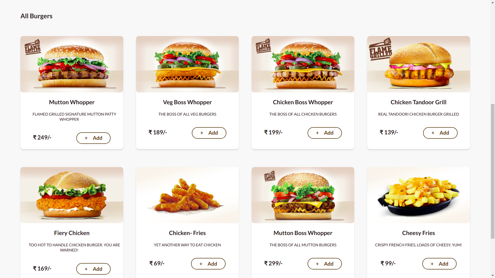
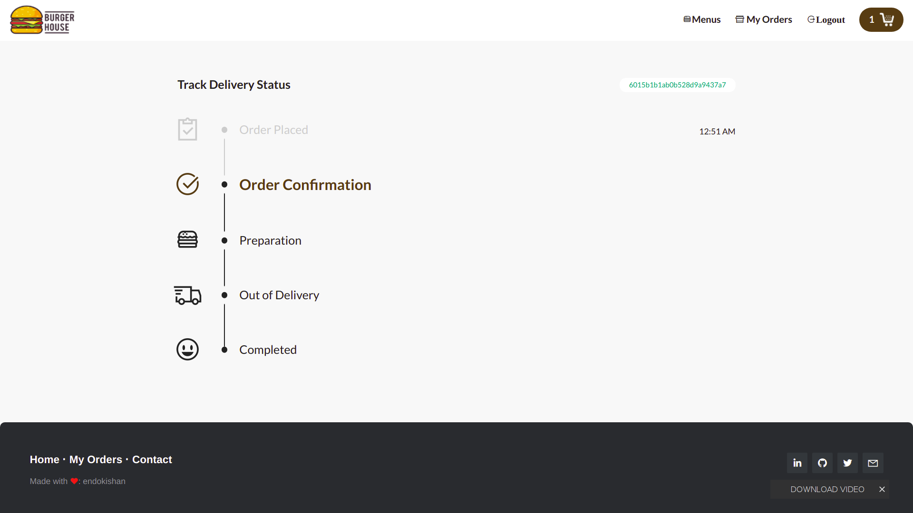

# Burger House (Realtime Delivery Status)

### Burger House a Ecommerce Store using Node-Express-Mongo-Typescript-Spcket.io-Stripe.

<hr>

## Core Features :-

#### Contains Two User Roles : 
- Customer 
- Admin

#### __Customers__ : Customer can place Orders by COD or Card Payment _(Stripe)_ and can also Track the Order status in __Realtime__.
- Email : testuser@gmail.com 
- Password : Test@123
#### __Admin__ : Admin can see all the orders and can change the order status in __Realtime__.
- Email : testadmin@gmail.com
- Password : Test@123

<hr>

### __Live Project__ :-  <a href="http://3.17.207.4/"> <i>click here</i></a> ( deployed on AWS ).

<hr>

## Images Sample 
<div align="center">


</div>
<hr>

## Run locally on your machine:
You need to have installed __globally__  _npm_.

Global Pacakage
``` shell
npm i -g nodemon ts-node typescript
```

Clone this repository
``` shell
git clone https://github.com/endokishan/burgerhouse.git
```

Install dependencies
``` shell
npm install
```

> **_NOTE :_**  Rename .env.example to .env and place your Key.


Start NodeJS Server 
``` shell
npm run dev
```

<hr>

### Backend Tech Stack :- 
- [Node js](https://nodejs.org/en/)
- [Typescript](https://www.typescriptlang.org/)
- [Express js](https://expressjs.com/)
- [Mongoose](https://www.mongodb.com/)

### Frontend Tech Stack :- 
- [Javascript](https://www.javascript.com/)
- [Saas](https://sass-lang.com/)
- [ejs](https://ejs.co/)
- [Laravel Mix](https://laravel-mix.com/)

### Packages :- 
- [Node js](https://nodejs.org/en/)
- [Typescript](https://www.typescriptlang.org/)
- [Express js](https://expressjs.com/)
- [Mongoose](https://www.mongodb.com/)
- [Laravel Mix](https://laravel-mix.com/)
- [Socket IO](https://socket.io/)
- [Passport js](http://www.passportjs.org/)
- [Stripe](https://stripe.com/en-in)
- [Noty](https://www.npmjs.com/package/noty)
- [Moment](https://momentjs.com/)
- [Express-Session](https://www.npmjs.com/package/express-session)
- [Express-Flash](https://www.npmjs.com/package/express-flash)
- [ejs](https://ejs.co/)
- [Dotenv](https://www.npmjs.com/package/dotenv)
- [Bcrypt](https://www.npmjs.com/package/bcrypt)
- [Axios](https://www.npmjs.com/package/axios)

<hr>

For any extra questions, please contact me at endokishan@gmail.com. 

🙏 If you find this repo helpful then don't forget to give a start ❇️ to this repository. :)

<hr>